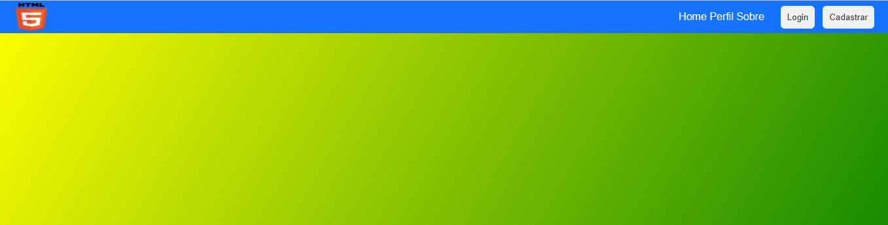

# Criando um Header com Flexbox 

  </img>

 

### Detalhes do projeto

Projeto de um site responsivo usando apenas HTML e CSS feito com o objetivo de praticar a especificação Flexbox. 
Nesse projeto aprendi:
  
• A posicionar elementos na página usando o flexbox; 
• A usar as propriedades do flexbox; 
• E pratiquei a responsividade usando o flexbox;
 

### Tecnologias utilizadas:

  
  

 

### Visualização do projeto: 

- [Header com Flexbox](https://criandoheadercomflexbox.netlify.app)

