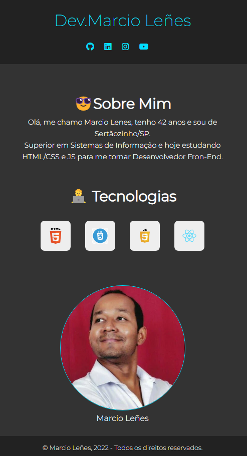

# Portfólio Simples utilizando Flexbox [Com Responsividade]

Projeto de um site responsivo usando apenas HTML e CSS feito com o objetivo de praticar a especificação Flexbox. 
Nesse projeto aprendi:  
• A posicionar elementos na página usando o flexbox; 
• A usar as propriedades do flexbox; 
• E pratiquei a <b>responsividade</b> criando um arquivo <b>responsive.css</b>;

Visualização do site: https://portfoliosimplesresponsivo.netlify.app/

## Screenshots

  </img>

